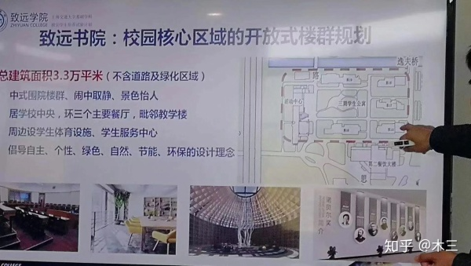
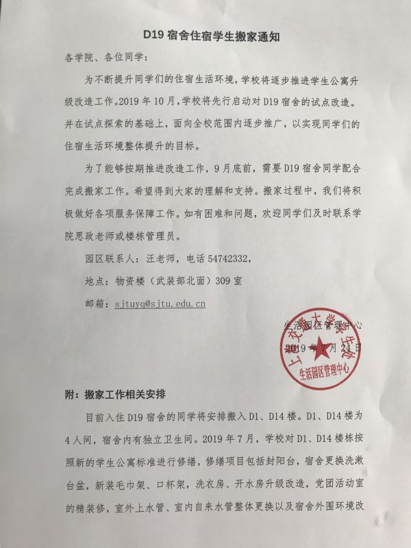
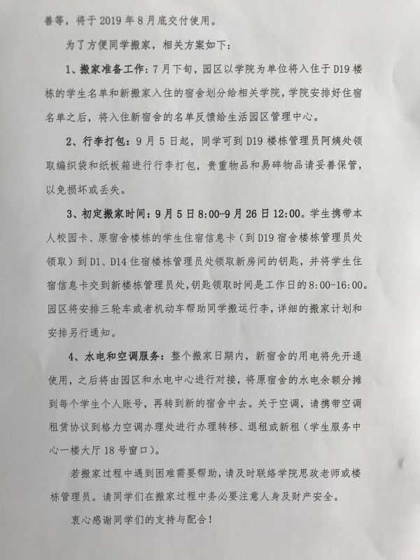
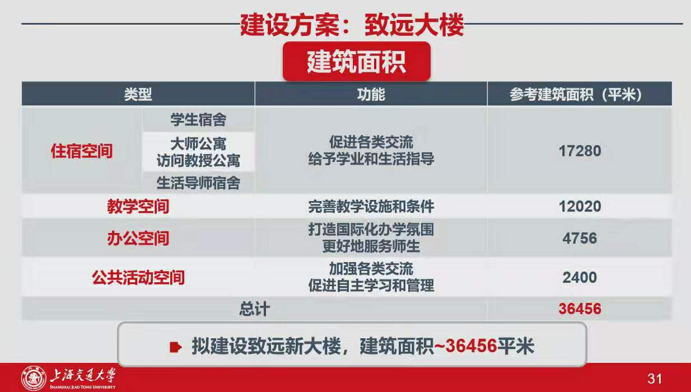
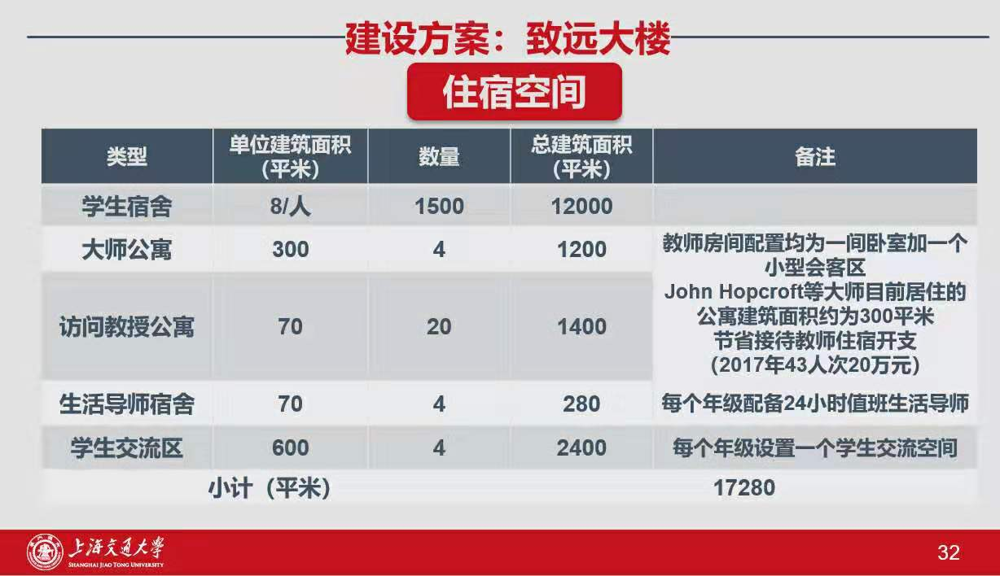
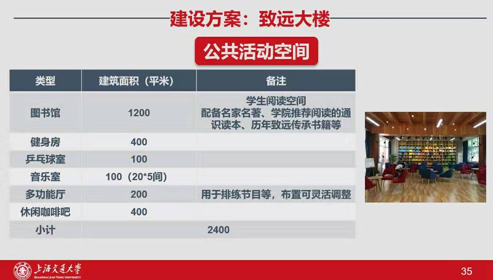
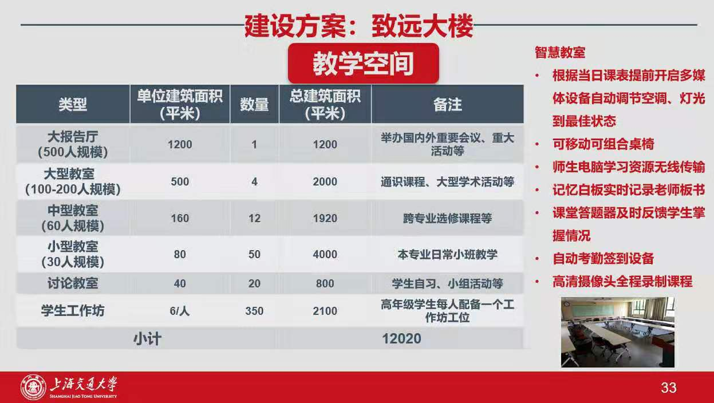
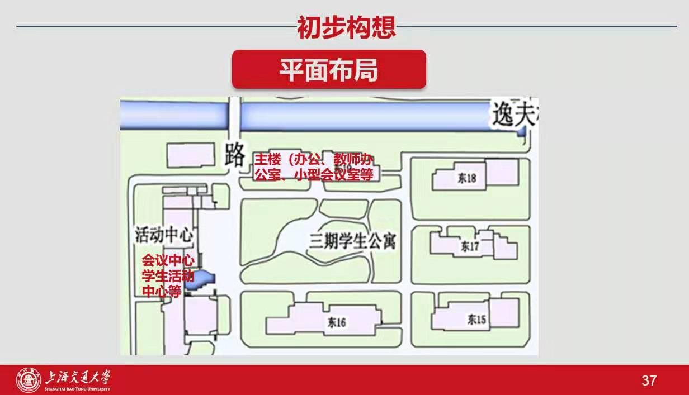

# WanderingD19

详情：[GitPage](https://wanderingd19.github.io/WanderingD19/)

## 发生了什么事？
### 2019年7月18日及以前
有小道消息传出学生公寓D19及D16将搬迁，以安排新的致远书院计划中**致远学生**的入住。

校招标办网站贴出光彪楼改造招标通知，其中说明了西、北、南界，但对涉及东侧二期学生公寓（包括D16-D19)的界限并未说明。（http://zbb.sjtu.edu.cn/cgc/29331.jhtml）

D19宿舍人员绝大多数为17级工科试验班同学，9月开学后升入大三。在入校前，招办曾口头承诺，在大学四年不进行寝室的更换。因此，D19的同学们放心地进行了宿舍的装修改造和设施添置。

知乎问题被添加（见下），普遍认为属谣言。

### 2019年7月18日至7月24日
不断有消息传出，包括致远书院的规划图，由图中可以看出D16-D19属于改造范围:

### 2019年7月24日
D19被确定搬迁至D1、D14，相关正式通知已下达，通知中涉及搬迁的时间地点，对搬迁原因的解释仅为“不断提升同学们的住宿生活环境“，并未提及光彪楼及致远书院。同时，D16、D18宿管称，毕业前将不会搬迁。

D19楼长在楼栋群中公布了搬迁的大致安排。根据这份安排，现有的相处两年的室友将进行更换。

D1、D14的地理位置差于D19，宿舍设施不优于D19。

### 2019年7月25日

更新二月十三微博上披露的致远大楼规划，将建在D19原址上。

更多链接：
- 知乎：[如何看待上海交通大学要求D19宿舍楼学生集体搬迁？](https://www.zhihu.com/question/335607167)

## 这个库用来干什么？
- 客观公正的记录整个事件中的过程，以及各家发出的声音。
- 监督学校的行为，透明公开事情进度。
- 如果您有其他的目的及用途，fork this repo and do whatever you want.

## 我能做什么？
- 给项目点star，增加关注度。
- 转发项目链接，让更多人知道。
- 有能力的同学可以提交PR参与项目建设。

## 如何参与项目？
1. 首先fork项目，然后clone下来。
2. 修改内容或者新建页面。
3. 在 `images` 文件夹下添加图片，命名格式为 `日期+数字` 例如 `2019072401`，数字可不必严格递增但请保持唯一。
4. 在本仓库提交PR。
