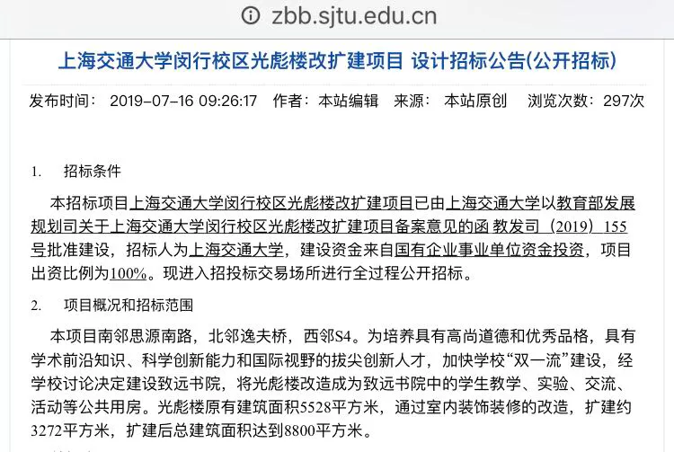
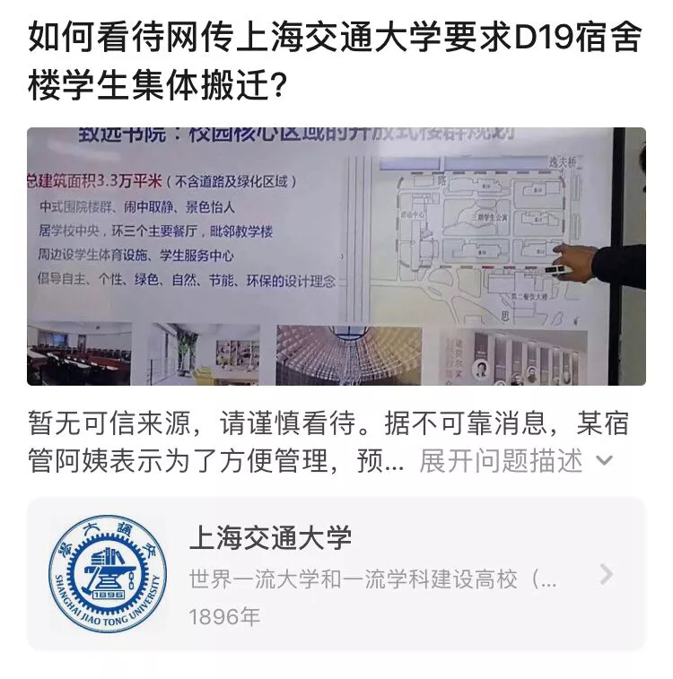
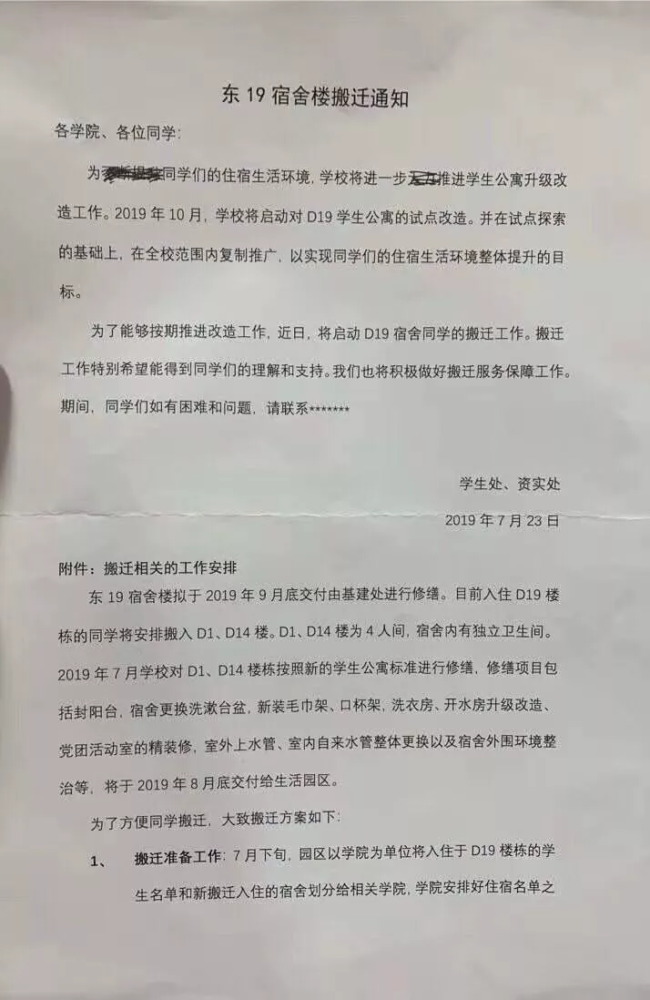
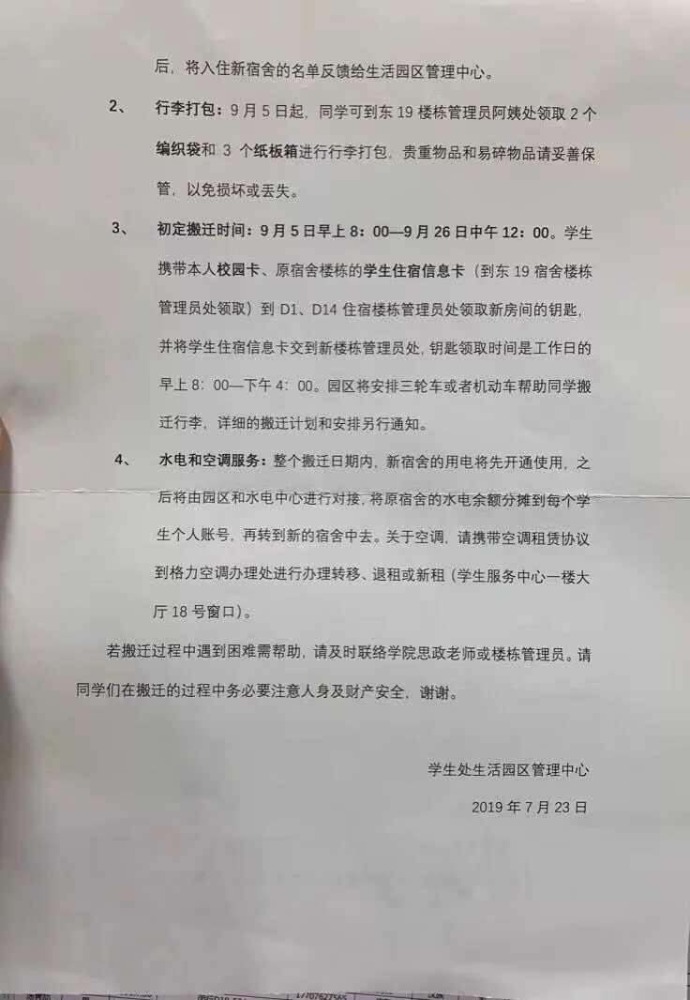

# 七问交大「致远书院」

微信公众号【二月十三】2019-07-24 推文备份。

为什么信息这么不公开透明？

为什么信息这么不公开透明？

为什么信息这么不公开透明？

为什么信息这么不公开透明？

为什么信息这么不公开透明？

为什么信息这么不公开透明？

为什么信息这么不公开透明？

升级建设致远书院应该算是学校的重要决策，但是这样的决策却不是在信息公开网上主动公布的，而是通过基建招标文件中的短短几句话确定的。

因为信息不公开透明，而实际的工作已逐渐展开，在各个环节就会有零散的消息流出，包括此前光彪楼部分场所搬迁的消息，东二区部分宿舍需要搬迁的消息等。

这些来源无法确定的消息，混杂入一些加工、想象、猜测、质疑，很容易带来一些情绪。

于是人们到处确认是否真实，一方面加大了基层工作人员，比如宿管阿姨思政辅导员的压力，一方面只能在网络上没有效率地求证。

决策不公开透明，执行却雷厉风行，隔阂与信任危机的产生，最后伤的是谁的心？

